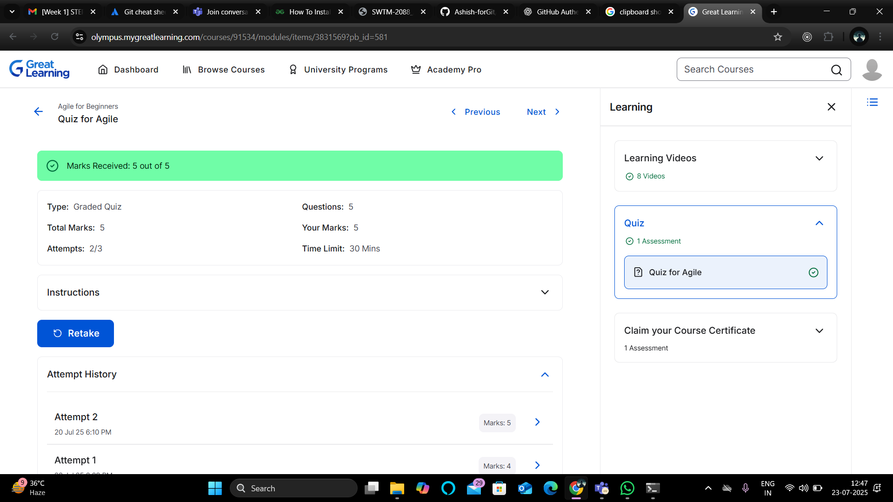

# 💼 LTTS STEPIn Training

Welcome to the documentation of my progress in the LTTS STEPIn Pre-joining Training Program. This repository contains modules, assignments, and proof of completion.

---

## 📘 Week 1 – Module 1: *Applied SDLC, Agile & Testing Methodology*

- Covered topics like SDLC models, Agile methodology, and testing principles.
- Successfully completed the Agile quiz with full marks ✅

### 🖼️ Agile Quiz Completion Screenshot:

---

## 💻 Week 2 – Module 2: *Collaboration and Source Code Management with Git*

- Learned Git fundamentals, branching, merging, and working with GitHub.
- Practiced hands-on commands for local and remote repository management.

### 🖼️ SimpliLearn Git Training Certificate Screenshot:

### 🖼️ CodeSignal Git Training Certificate Screenshot:

---

## 🐧 Week 3 – Module 3: *Basic of Linux Commands*

- Practiced using CLI for file and directory management, permissions, and basic process monitoring.
- Understood how to use command options and navigate the Linux filesystem efficiently.
- During this module, I practiced essential Linux commands including navigation commands like `pwd`, `cd`, `ls` (with options like `-l` and `-a`), and file management commands such as `touch`, `mkdir`, `rmdir`, `cp`, `mv`, `rm`, and `cat`. I also explored file content preview tools like `head` and `tail`, display and messaging commands like `echo`, `clear`, `whoami`, and `date`, and help utilities like `man`.
- Command history and permission-related commands like `history`, `chmod`, and `chown` were also used. For      searching and system info, I practiced `grep`, `find`, `df`, `du`, and for process management, commands like `top`, `ps`, and `kill` were covered. I wrapped up sessions using `exit` to close terminal environments.

### 📂 Proof of Practice:

Screenshots and command outputs demonstrating hands-on Linux command practice are available in the [Linux](Linux/) folder of this repository.

---

## 🔣 Week 3 – Module 4: *Essentials of C Programming*

### 🖼️ SoloLearn C Programming Certificate Screenshot:

### 🖼️ SoloLearn C Intermediate Certificate Screenshot:

---

## 🧪 Week 4 – Module 5: *Unit Testing using Unity*

- Learned fundamentals of unit testing in C using the Unity test framework.
- Implemented test cases for various C functions and handled both normal and edge cases.
- Gained experience in running test suites, organizing test files, and integrating Unity with Makefiles.

### 📅 Day-wise Practice:

### 📅 Day-wise Practice:
1. **[Day 1 – GCC Compilation & Basic Commands](Unit%20Testing%20using%20Unity/Day1)**  
   - Practiced compiling and linking C programs step-by-step:  
     1. `gcc filename.c -c` → Compile and generate object files (`.o`) for each `.c` file.  
     2. `gcc filename.o -o all.out` → Link all object files and generate the executable.  
     3. `./exe` → Run the generated executable file.  
     4. `rm -rf *.o *.out` → Remove all object files and output executables.  

2. **[Day 2 – Makefile Methods](Unit%20Testing%20using%20Unity/Day2)**  
   - Explored different approaches to writing `Makefile` for compiling and running Unity tests:  
     - **Single-line compilation** using `gcc` with all `.c` files in one command.  
     - **Stepwise object file generation** with `-c` option, followed by linking in a separate rule.  
     - **Pattern rules** using `%.o: %.c` to automate `.c` to `.o` compilation.  
     - **Automatic variables** like `$@` (target), `$<` (first dependency), and `$^` (all dependencies).  
     - **`make clean`** rule to remove temporary build files (`*.o`, `*.out`).  

3. **[Day 3 – Multifile & Makefile Integration](Unit%20Testing%20using%20Unity/Day3)**  
   - Created test cases for functions spread across multiple source files.  
   - Automated compilation and execution using `Makefile`.  

4. **[Day 4 – Testing Arrays & Pointers](Unit%20Testing%20using%20Unity/Day4)**  
   - Wrote unit tests to validate functions handling arrays and pointers.  
   - Tested `swap()` function with valid pointers and `NULL` pointers for crash prevention.  
   - Verified array-related functions with both normal and edge case inputs. 

---